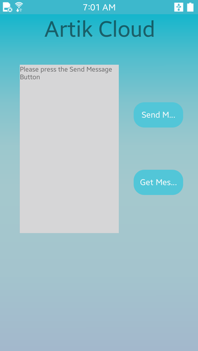
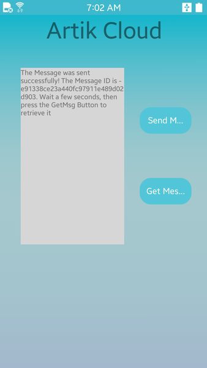
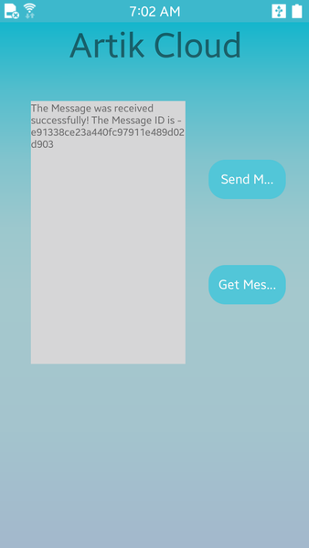
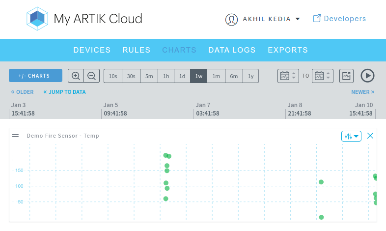

# ARTIK Cloud Tizen SDK starter code

This sample code sends and gets a message to and from ARTIK Cloud. It uses the [ARTIK Cloud Tizen SDK](https://github.com/artikcloud/artikcloud-tizen) to make REST API calls.

### Prerequisites
* [Tizen IDE/Tizen Studio](https://developer.tizen.org/development/tizen-studio/download) with the `Native app. Development (IDE)` package for 2.4 installed.
* [ARTIK Cloud Tizen SDK](https://github.com/artikcloud/artikcloud-tizen) version >= 2.0.0

### Setup / Installation:

 1. Sign into [My ARTIK Cloud](https://artik.cloud/)
 2. On the device dashboard, click to connect a new device. Select the Demo Fire Sensor (from cloud.artik.sample.demofiresensor) and name your sensor SampleFireSensor (or any name you'd like).
 3. Click the Settings icon of the device you just added. Get the **device ID** and **device token**. If the token does not already exist, click "GENERATE DEVICE TOKEN…" to get one.
 4. Install the ARTIK Cloud Tizen SDK. See the [instructions](https://github.com/artikcloud/artikcloud-tizen) here.
 5. Import the sample project to Tizen Studio by going to `File -> Import -> Existing Projects into Workspace -> Click Browse next to Select root directory -> Select` the sample folder from the current repository.
 6. In Tizen studio, edit the `src/callRule.cpp` file, replacing "deviceId" and "deviceToken" with the ones you obtained in step 3.

## Run the code

Launch the application on your Tizen by clicking the run button.

Here's a screenshot of application:



Press the Send Message Button.
If sending goes well, you receive a response with a message id (mid). ARTIK Cloud uses this response to acknowledge the receipt of the message as shown below.

```C++
//response after sending message
class MessageIDEnvelope {
    data: class MessageID {
        mid: ae3901fd19fb4bd98cee030bedb373d1
    }
}
```



After sending, retrieve the last message with a Asynchronous call. Below is the response. It has a 'temp' value that was sent earlier.

```C++
//response after getting last message
class NormalizedMessage {
    cts: 1475839013635
    ts: 1475839013635
    mid: 4ecc382d3c2044c3b456474bb923bdaa
    sdid: 77519dfc680f45798c3203922087fda8
    sdtid: dt856e54302a294fba80414b87eb7b79a3
    uid: e03d4458bc8b462db048775dc17107f9
    mv: 1
    data: {temp=199.0}
}
```



## Peek into the implementation

Take a closer look at the file  **`/src/callRule.cpp`**

Import the artikcloud `MessagesManager` class, and set the namespace to `Tizen::ArtikCloud`

```C++
#include <callRule.h>
#include <MessagesManager.h>
#include <dlog.h>
#include <stdlib.h>
#include <chrono>
#include <string>
#include <map>

using namespace Tizen::ArtikCloud;
using namespace std;

//REMEMBER TO REPLACE THESE
char deviceId[] = "170e5221612b4bc38dce53fd4395174a";
char deviceToken[] = "1718113118564ad495ad03f04116f379";
```

The two methods `sendMessageAction()` and `getLastNormalizedMessages()` are the part of the MessagesAPI. Lets create an instance of the API first.

```C++
//First create an instance of the corresponding manager class
MessagesManager msgMgr;
```
To send a message, we first create a callback handler function which will be called at the end of the API call.
The data retuned is contained in `MessageIDEnvelope msgEnv`, errors (if any) in `Error err`.
`userData` is a pointer that can be passed while calling the API and is supplied to the handler.

```C++
//Define the callback handler which will be called after calling SendMessage function
void sendMessageHandler(MessageIDEnvelope msgEnv, Error err, void* userData) {

	dlog_print(DLOG_INFO, "DEMO", "Send Message done with error %d and code %s",
			err.getCode(), err.getMessage().c_str());
	//Print the full Json in dlog
	dlog_print(DLOG_INFO, "DEMO", "msgEnv is %s", msgEnv.toJson());

	currentLabel = "";

	//Check if the API call was successfull
	if (err.getCode() == 200) {
		dlog_print(DLOG_INFO, "DEMO", "Send Message successful");

		std::string response = msgEnv.getData().getMid();
		currentLabel.append(
				"The Message was sent successfully! The Message ID is - ");
		currentLabel.append(response);
		currentLabel.append(
				". Wait a few seconds, then press the GetMsg Button to retrieve it");

	} else {
		dlog_print(DLOG_INFO, "DEMO", "Send Message NOT successful");
		string errmsg = err.getMessage();
		dlog_print(DLOG_INFO, "DEMO",
				"the error code is %d and error message is %s", err.getCode(),
				errmsg.c_str());

		//display the error
		currentLabel.append(
				"The Message was Not sent successfully! This is the error message - ");
		currentLabel.append(err.getMessage());
	}
	//display currentLabel
	elm_object_text_set(mylabel, currentLabel.c_str());
	return;
}
```

To send a message we instantiate the Message data type which holds a Message.

```C++
Message data;

//Set sdid to send with the message
data.setSdid(deviceId);
data.setType("message");

//Set the timestamp tp current time
ms = chrono::duration_cast < chrono::milliseconds
	> (chrono::system_clock::now().time_since_epoch()).count();
data.setTs(ms);

//Create a Map to send as data in the message
//The "temp" value is randomly generated from 0-199
//The "onFire" value is false
map<string, string> myData;
string temperature = "temp";
int randTemp = rand() % 200;
string tempval = std::to_string(randTemp);
myData.insert(pair<string, string>(temperature, tempval));
myData.insert(pair<string, string>("onFire", "false"));
data.setData(myData);

//Send the Message by calling the API
msgMgr.sendMessageAsync(deviceToken, data, sendMessageHandler, NULL);
```

Similary, we define a callback handler for getting messages

```C++
void getLastNormalizedMessageHandler(NormalizedMessagesEnvelope msgEnv,
		Error err, void* userData)
```

API call to get message for the device:

```C++
msgMgr.getLastNormalizedMessagesAsync(deviceToken, 1, deviceId, "",
	getLastNormalizedMessageHandler, NULL);
```

Check out the Messages REST API:
  - [POST a message REST call](https://developer.artik.cloud/documentation/api-reference/rest-api.html#post-a-message-or-action).
  - [Get the last message REST call](https://developer.artik.cloud/documentation/api-reference/rest-api.html#get-last-normalized-messages)

## View your data in My ARTIK Cloud

Have you visited ARTIK Cloud [data visualization tool](https://my.artik.cloud/data)?

Select your device from the charts to view your device data in realtime. Try running the application multiple times in your terminal to send a few random values.  Here's a screenshot:



## More Documentation

 - [ARTIK Cloud Tizen SDK documentation] (https://github.com/artikcloud/artikcloud-tizen)
 - [Tizen Getting Started](https://developer.tizen.org/development/training/native-application/getting-started/creating-your-first-tizen-mobile-native-application)

More about ARTIK Cloud
---------------

If you are not familiar with ARTIK Cloud, we have extensive documentation at https://developer.artik.cloud/documentation

The full ARTIK Cloud API specification can be found at https://developer.artik.cloud/documentation/api-reference/

Peek into advanced sample applications at https://developer.artik.cloud/documentation/samples/

To create and manage your services and devices on ARTIK Cloud, visit the Developer Dashboard at https://developer.artik.cloud

License and Copyright
---------------------

Licensed under the Apache License. See [LICENSE](LICENSE).

Copyright (c) 2016 Samsung Electronics Co., Ltd.
